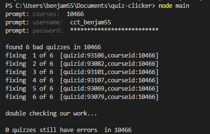

# Fix Canvas Quizzes with Update Hack

Uses puppeteer to go into quizzes and "edit" every question, though it doesn't actually change anything. This will prevent the quiz from throwing a 500 error with the API.

## Use

courses can be a whatever delimited list of courses